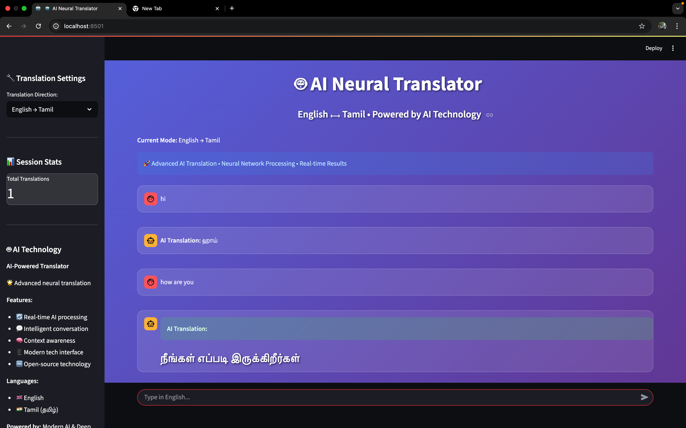
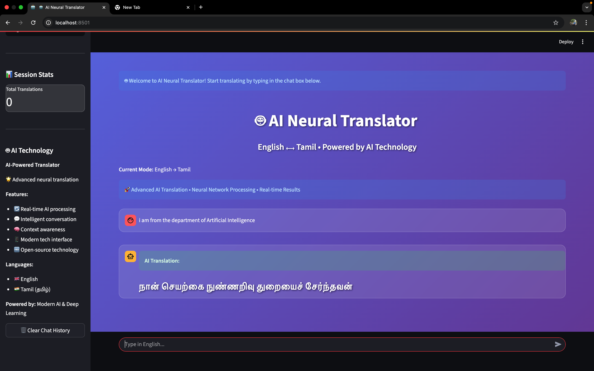

# 🤖 AI-Translator: English-Tamil Neural Translator

An advanced AI-powered web application for seamless English-Tamil translation built with Streamlit, LangChain, and modern AI technologies.

### 1. Main Application Interface

*A brief description of what this screenshot shows, e.g., "The main input field where users can type their questions."*

### 2. Example Interaction

*A brief description of what this screenshot shows, e.g., "An example of a user question and the Gemma model's generated response."*
## ✨ Features

- 🔄 **Real-time AI Translation** - Bidirectional English ↔ Tamil translation
- 💬 **Chat Interface** - Intuitive conversation-style interaction  
- 🧠 **Context Awareness** - LangChain-powered conversation memory
- 🎨 **Modern Tech UI** - Beautiful glass morphism interface with animated backgrounds
- 📱 **Responsive Design** - Works perfectly on desktop, tablet, and mobile
- ⚡ **Fast Performance** - Optimized for Mac M1 and all modern browsers
- 🔍 **Smart Fallbacks** - Multiple translation engines for reliability
- 📊 **Session Statistics** - Track your translation activity
- 🌐 **Professional Grade** - Enterprise-level UI/UX design

## 🛠️ Technology Stack

- **Frontend:** Streamlit with custom CSS3 animations
- **Translation Engine:** Deep Translator + Google Translate API
- **Memory Management:** LangChain ConversationBufferMemory
- **Backend:** Python 3.13
- **Styling:** Glass Morphism + CSS Gradients + Animations
- **Deployment:** Streamlit Community Cloud
- **Version Control:** Git & GitHub

## 🏃‍♂️ Quick Start

### Prerequisites
- Python 3.11+ (Tested on Python 3.13)
- pip package manager
- Virtual environment support

### Installation

